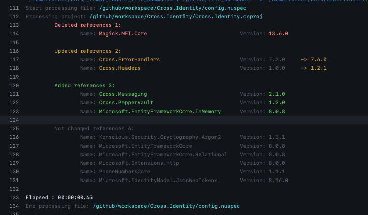

[](LICENSE)
[](https://github.com/denis-peshkov/update-nuspec-action/releases)
[](https://sonarcloud.io/summary/new_code?id=UpdateNuspecTool)
[](https://github.com/denis-peshkov/update-nuspec-action/issues)
[](https://github.com/denis-peshkov/update-nuspec-action/actions/workflows/ci.yml)


[](https://github.com/denis-peshkov/update-nuspec-action/contributors)
[](https://github.com/denis-peshkov/update-nuspec-action/commits/master)


# update-nuspec-action

CLI (Rust) GitHub Action (Docker) that scans .NET projects in a directory and updates the `<dependencies>` section in matching `*.nuspec` files according to `PackageReference` versions from the related `.csproj` (project name = `<id>` in nuspec metadata). Optionally updates `package.json` version and scoped npm dependencies.

## Usage

Pin a [release tag](https://github.com/denis-peshkov/update-nuspec-action/releases) (recommended):

```yaml
- uses: actions/checkout@v4

- uses: denis-peshkov/update-nuspec-action@v1
  with:
    dir: src/MyPackage
```

`dir` is relative to `/github/workspace` (repo root after `checkout`). An absolute path (starting with `/`) is used as-is.

Dry-run (report only, no file writes):

```yaml
- uses: denis-peshkov/update-nuspec-action@v1
  with:
    dir: src/MyPackage
    dryRun: true
```

### Checklist (consumer workflow)

```yaml
jobs:
  update-nuspec:
    runs-on: ubuntu-latest   # linux/amd64; see Requirements
    steps:
      - uses: actions/checkout@v4

      - uses: denis-peshkov/update-nuspec-action@v1
        with:
          dir: src/MyPackage   # explicit folder — not "." unless you want the whole repo
          dryRun: false        # true = preview in logs, no writes
        env:
          CONSOLE_ANSI_COLOR: false   # omit or true for colored log (default in image: true)
```

## Inputs

| Input | Required | Default | Description |
|-------|----------|---------|-------------|
| `dir` | No | `.` | Root folder to scan **recursively** for `.csproj` / `.nuspec` pairs and (when `packageVersion` is set) `package.json`, relative to `/github/workspace`. Prefer a package path (`src/MyPackage`); `.` scans the entire checkout including nested folders (tests, other packages). |
| `dryRun` | No | `false` | `true` — full report in the log, no file changes (`[DRY RUN]`). |
| `packageVersion` | No | *(empty)* | SemVer for `package.json` `version`. Azure DevOps: `$(GitVersion_SemVer)` after `gitversion/execute`. Env fallback: `PACKAGE_VERSION`, `GitVersion_SemVer`. |
| `dependencyScope` | No | *(empty)* | npm package name prefix to set to `^packageVersion`. Skipped when empty. |

## Outputs

| Output | Description |
|--------|-------------|
| `packageVersion` | Echo of the `packageVersion` input when it was provided. |

## Behavior

- Recursively looks for `*.nuspec` under `dir` (all subfolders).
- Loads `{id}.csproj` from the **same folder as each** `.nuspec`, where `{id}` is `<metadata><id>`.
- **Flat** nuspec — top-level `<dependency id="..." version="..." />` under `<dependencies>`. Package list is taken for `TargetFramework`, or the first TFM from `TargetFrameworks`.
- **Grouped** nuspec — `<group targetFramework="net8.0">` (and other TFMs). Each group is synced only with packages that apply to that TFM in the csproj:
  - `PropertyGroup Condition="'$(TargetFramework)' == 'net6.0'"` (and similar) for version properties;
  - `PackageReference` with `Version="$(PropertyName)"` resolved per TFM;
  - `Condition` on `PackageReference` / `ItemGroup`, including `or` (for example `'$(TargetFramework)' == 'net6.0' or '$(TargetFramework)' == 'net7.0' or '$(TargetFramework)' == 'net8.0'`).
- Updates versions, adds packages from the csproj, removes dependencies that are not in the csproj for that TFM / flat list.
- Saved dependency order: `Cross.*`, then `*Boilerplate*`, then `*.Api.Contract*`, then the rest (A–Z).
- **Console report:** grouped nuspec — one block per `<group targetFramework="...">`; flat nuspec — single block. Categories: deleted, updated, added, not changed.
- `PrivateAssets="All"` references (for example SourceLink) are not written to nuspec.
- Exits with code `0` if no `.nuspec` files are found (prints `*.nuspec files not found!`).
- Prints an error if `dir` does not exist (`Path '…' is not valid!`).
- **Dry-run** — GitHub Action input `dryRun: true`, or CLI flags `--dry-run` / `-d` / `--demo` (or positional `true`): full report, no file save (`[DRY RUN]` in the log).
- **`package.json`** (optional) — when `packageVersion` is set: updates `"version"` in every `package.json` under `dir` (skips `node_modules`). When `dependencyScope` is also set, aligns matching npm dependencies to `^packageVersion`.

Example multi-TFM project: `UpdateNuspecTool.Tests/TestData/Cross.Messaging.csproj` + `Cross.Messaging.nuspec`.

## Example output

Colored log when `CONSOLE_ANSI_COLOR=true` (default in the action image). In **dry-run** mode (`dryRun: true` / `--dry-run`) the same report is printed, categories are shown in gray, and files are not saved (`[DRY RUN]` in the log).

### 1. Sync nuspec dependencies

For each `.nuspec` the tool prints a categorized diff against the sibling `{id}.csproj`:

| Category | Color | Meaning |
|----------|-------|---------|
| Deleted references | red | In nuspec, not in csproj for this TFM |
| Updated references | yellow | Same package id, version changed (`old -> new`) |
| Added references | green | In csproj, missing from nuspec |
| Not changed references | gray | Same id and version |

`Cross.Identity` (`config.nuspec` + `Cross.Identity.csproj`):

```yaml
- uses: denis-peshkov/update-nuspec-action@v1
  with:
    dir: Cross.Identity
```



### 2. Update package.json (built npm package)

With `packageVersion` and `dependencyScope` — updates `version` and scoped npm dependencies (e.g. `client/dist/ui/package.json`). After [GitVersion execute](https://github.com/gittools/actions):

```yaml
- uses: gittools/actions/gitversion/execute@v1.1.1
  id: gitversion

- uses: denis-peshkov/update-nuspec-action@v1
  with:
    dir: client/dist/my-app
    packageVersion: ${{ env.GitVersion_SemVer }}
    dependencyScope: '@guru/'              # optional; empty = skip dependency alignment
```

## Requirements

This action is a **Docker container action** (`runs.using: docker` in `action.yml`). GitHub runs it only on **Linux** runners; the image is `linux/amd64` with a `linux-x64` tool binary.

- **Runner:** `ubuntu-latest` (recommended) or any **linux/amd64** self-hosted host with Docker.
- **`windows-latest` / `macos-latest`:** **not supported** — container actions do not run on Windows or macOS hosted runners. Use a separate job on `ubuntu-latest` (other jobs in the workflow may still use Windows).
- **Self-hosted ARM runners:** not supported as-is — use `ubuntu-latest`, or a self-hosted **amd64** Linux agent, or dedicate one job to `runs-on: ubuntu-latest`.
- **Colored log output:** enabled by default in the image (`CONSOLE_ANSI_COLOR=true`). Override with `env: CONSOLE_ANSI_COLOR: false` on the step if needed.

**On Windows:** use the Rust CLI (`cargo build --release` in `update-nuspec/`, see [CLI (local)](#cli-local)) or the [Azure DevOps extension](#azure-devops-extension) (`UpdateNuspec@1` on `windows-latest`).

Mixed workflow example (build on Windows, nuspec sync on Linux):

```yaml
jobs:
  build:
    runs-on: windows-latest
    steps:
      - uses: actions/checkout@v4
      # …

  sync-nuspec:
    runs-on: ubuntu-latest
    steps:
      - uses: denis-peshkov/update-nuspec-action@v1
        with:
          dir: src/MyPackage
```

## Versioning (this repository)

[GitVersion](https://gitversion.net/) (`GitVersion.yml`) on push:

| Branch | SemVer (example) | Git tags | GHCR image | GitHub Release | Chocolatey | Homebrew | ADO extension |
|--------|------------------|----------|------------|----------------|------------|----------|---------------|
| `master` | `1.2.3` (stable) | `v1.2.3`, `v1.2`, `v1` | `:1.2.3`, `:1.2`, `:1`, `:latest` | **Release** (binaries + VSIX) | push (stable) | core PR / bump | Marketplace **public** |
| `release/*`, `hotfix/*` | `1.3.0-preview.4` | — (no `@v` tags; Pre-release tag in `publish-github-release.yml`) | `:1.3.0-preview.4` only | **Pre-release** (binaries + VSIX) | push (prerelease) | — (skipped) | VSIX in Release assets |

Preview branches publish everywhere except Homebrew (homebrew-core does not accept prereleases) and moving git tags (`@v1`, `@v1.2`, `:latest` point to stable master only). GHCR image `:version` is still pushed for preview.

CI creates a [GitHub Release](https://github.com/denis-peshkov/update-nuspec-action/releases) via `publish-github-release.yml` (parallel with `publish-chocolatey.yml` and, on `master`, `publish-homebrew.yml`). On `master`, git tags and pinned `action.yml` are pushed from `build.yml` first; on preview branches the release tag is created only when publishing the Pre-release (not pushed from `build.yml`).

ADO Marketplace publish uses secret `AZDO_MARKETPLACE_PAT` (scope **Marketplace (Publish)**), publisher **peshkov**.

After merge to `master`, CI pins `action.yml` to the matching GHCR image tag and updates git tags **`v{major}`**, **`v{major}.{minor}`**, and **`v{semVer}`** (for example `v1`, `v1.2`, `v1.2.3` → image `:1.2.3`; `@v1` / `@v1.2` → `:1` / `:1.2`). Use:

```yaml
uses: denis-peshkov/update-nuspec-action@v1      # latest stable 1.x.y on master
# or an exact release:
uses: denis-peshkov/update-nuspec-action@v1.2.3
```

The `@v1` tag is a **moving** pointer to the latest major-1 release; after breaking changes in 2.x, switch to `@v2`.

## Azure DevOps extension

The same tool is available as pipeline task **`UpdateNuspec@1`** on [Visual Studio Marketplace](https://marketplace.visualstudio.com/items?itemName=peshkov.update-nuspec). Usage, examples, inputs, and preview install: [azure-devops-extension/marketplace/overview.md](azure-devops-extension/marketplace/overview.md).

## Development

### Repository layout

| Path | Role |
|------|------|
| `update-nuspec/` | Rust CLI and library (`update-nuspec` binary) |
| `UpdateNuspecTool/` | Legacy .NET CLI (parity tests) |
| `UpdateNuspecTool.Tests/` | NUnit tests and fixtures |
| `UpdateNuspecTool.Tests/TestData/` | Sample `.nuspec` / `.csproj` pairs |
| `Dockerfile` | Runtime image (`alpine`): copies prebuilt `musl` binary + `entrypoint.sh` (no Rust build in Docker) |
| `action.yml` | Action metadata; runs prebuilt GHCR image (`docker://ghcr.io/denis-peshkov/update-nuspec:…`) |
| `update-nuspec-icon.png` | Project icon (repo root) |
| `azure-devops-extension/` | Extension root (`vss-extension.json`); VSIX build in `build.yml` |
| `.github/workflows/` | CI orchestrator (`ci.yml`) and reusable workflow templates |
| `.github/workflows/scripts/` | Publish helper scripts (Homebrew, Chocolatey) |
| `scripts/` | Build helper scripts (`package-release-binary.sh`, `pin-action-image.sh`) |
| `azure-devops-extension/marketplace/` | Marketplace content: `overview.md`, `license.md`, `extension-icon.png` (symlink to project icon), screenshots |
| `azure-devops-extension/task/` | Pipeline task `UpdateNuspec@1` (TypeScript wrapper + bundled `update-nuspec` binaries) |

### Tests

```bash
cd update-nuspec && cargo test
```

```bash
dotnet restore UpdateNuspecTool.Tests/UpdateNuspecTool.Tests.csproj
dotnet test UpdateNuspecTool.Tests/UpdateNuspecTool.Tests.csproj --configuration Release --no-restore
```

CI runs both Rust and .NET tests in `build.yml` (orchestrated by `ci.yml`).

Fixtures: `UpdateNuspecTool.Tests/TestData/` (`MyPackage.nuspec`, `Cross.Messaging.nuspec`, `package.json`, …).

### CLI (local)

**Package managers** (after acceptance in the respective registries; binaries also on [GitHub Releases](https://github.com/denis-peshkov/update-nuspec-action/releases)):

```bash
brew install update-nuspec
```

```powershell
choco install update-nuspec
```

First Homebrew submission: [packaging/README.md](packaging/README.md#homebrew-homebrew-core).

Options: `--help` / `-h`, `--version` / `-v`, `--dry-run` / `-d` / `--demo` (or positional `true`), `--package-version` / `-pv`, `--dependency-scope` / `-ds`.

```bash
cd update-nuspec
cargo run --bin update-nuspec -- --help
cargo run --bin update-nuspec -- --version
cargo run --bin update-nuspec -- ../UpdateNuspecTool.Tests/TestData --dry-run
cargo run --bin update-nuspec -- ../client/dist/my-app --package-version 1.2.3 --dependency-scope @guru/
```

Release build:

```bash
cd update-nuspec
cargo build --release --bin update-nuspec
./target/release/update-nuspec ../UpdateNuspecTool.Tests/TestData --dry-run
```

**Windows (x64)** — CI builds with `x86_64-pc-windows-msvc` (same binary for Release, Chocolatey, and ADO), or build natively on Windows:

```powershell
cd update-nuspec
cargo build --release --bin update-nuspec
.\target\release\update-nuspec.exe ..\UpdateNuspecTool.Tests\TestData
```

**Linux (x64)** — used in the action Docker image and `ubuntu-latest`:

```bash
cd update-nuspec
cargo build --release --bin update-nuspec
./target/release/update-nuspec ../UpdateNuspecTool.Tests/TestData
```

| Platform | Binary |
|----------|--------|
| Linux x64 | `update-nuspec` |
| Windows x64 | `update-nuspec.exe` |
| macOS (local) | `update-nuspec` (`cargo build --release`) |

### Docker image

The action runs a **prebuilt image** from GHCR (`action.yml` → `image: docker://ghcr.io/denis-peshkov/update-nuspec:<version>`). CI builds it from the static `musl` binary produced by the release matrix (no Rust build in Docker) and pushes tags `X.Y.Z`, `X.Y`, `X`, and `latest`. The runtime is a small `alpine` image.

Build locally (stage the binary first, since `Dockerfile` only copies it):

```bash
cd update-nuspec && cargo build --release --target x86_64-unknown-linux-musl --bin update-nuspec && cd ..
mkdir -p docker && cp update-nuspec/target/x86_64-unknown-linux-musl/release/update-nuspec docker/update-nuspec
docker build --platform linux/amd64 -t update-nuspec-action:local .
docker run --rm --platform linux/amd64 \
  -v "$PWD:/github/workspace" \
  update-nuspec-action:local UpdateNuspecTool.Tests/TestData true
```

> First release only: make the GHCR package **public** (`github.com/users/denis-peshkov/packages/container/update-nuspec/settings`) so `uses: …@v1` can pull it without auth.

On Apple Silicon hosts, use `--platform linux/amd64` so the image matches GitHub-hosted runners.

## CI (GitHub Actions)

Entry point: [`.github/workflows/ci.yml`](.github/workflows/ci.yml) — triggers on **push** (`master`, `release/*`, `hotfix/*`), **pull_request**, and **workflow_dispatch**.

Reusable workflow templates (one resource per file):

| Template | Role | Runs when |
|----------|------|-----------|
| [`version.yml`](.github/workflows/version.yml) | GitVersion → `version`, `major`, `minor`, `channel`, `prerelease` | always |
| [`release-binaries.yml`](.github/workflows/release-binaries.yml) | Rust matrix (linux musl, macOS arm/intel, Windows); uploads `ado-binary-*` and, on release branches, `release-binary-*` | always |
| [`build.yml`](.github/workflows/build.yml) | Rust/.NET tests, SonarCloud, Docker smoke tests, GHCR push, ADO VSIX, pin `action.yml`, git tags (master) | always |
| [`publish-github-release.yml`](.github/workflows/publish-github-release.yml) | GitHub Release + binaries + VSIX + `SHA256SUMS` | push to release branches |
| [`publish-chocolatey.yml`](.github/workflows/publish-chocolatey.yml) | Embed Windows exe into `.nupkg`, push to chocolatey.org | push to release branches |
| [`publish-homebrew.yml`](.github/workflows/publish-homebrew.yml) | Formula draft, fork PR or `brew bump-formula-pr` | push to `master` only |

Pipeline (push to a release branch):

```
ci.yml
  version
    ├─ release-binaries (matrix)
    └─ build ──┬─ publish-github-release  ─┐ parallel
               ├─ publish-chocolatey       ─┤
               └─ publish-homebrew (master)┘
```

On **pull_request**: `version` → `release-binaries` → `build` only — no GHCR publish, no git tags, no package managers, no GitHub Release.

### Repository secrets (CI)

| Secret | Used in | Purpose |
|--------|---------|---------|
| `SONAR_TOKEN` | `build.yml` | SonarCloud scan |
| `TAGTOKEN` | `build.yml`, `publish-homebrew.yml` | Push git tags and pinned `action.yml`; Homebrew fork push / initial PR (`repo` scope) |
| `AZDO_MARKETPLACE_PAT` | `build.yml` | Publish ADO extension to Marketplace (master) |
| `HOMEBREW_GITHUB_API_KEY` | `publish-homebrew.yml` | `brew bump-formula-pr` / `gh pr create` (`public_repo`) |
| `CHOCOLATEY_API_KEY` | `publish-chocolatey.yml` | Push `.nupkg` to chocolatey.org |

Packaging details: [packaging/README.md](packaging/README.md).

## License

MIT — see [LICENSE](LICENSE).
