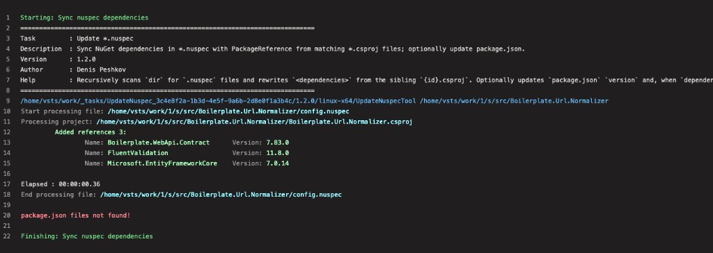
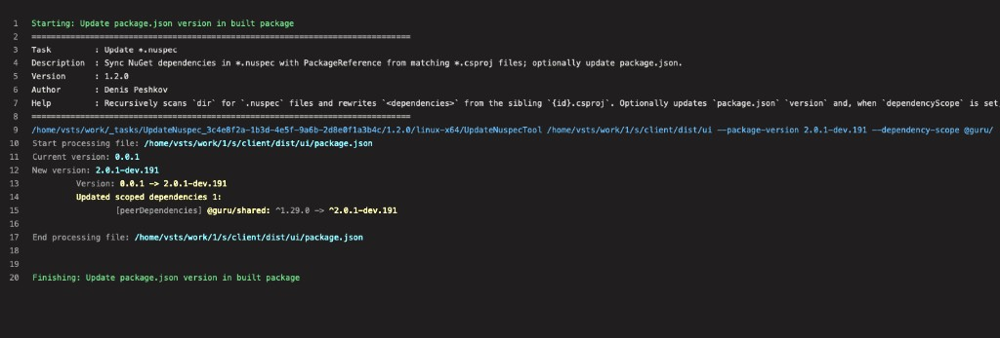

# Update *.nuspec

Pipeline task that scans a directory for `*.nuspec` files and updates the `<dependencies>` section from matching `PackageReference` entries in `{id}.csproj`. Optionally updates `package.json` (same behavior as the [update-nuspec-action](https://github.com/denis-peshkov/update-nuspec-action) GitHub Action).

**Install:** [Visual Studio Marketplace — peshkov.update-nuspec](https://marketplace.visualstudio.com/items?itemName=peshkov.update-nuspec)

Single extension **`update-nuspec`**, single task **`UpdateNuspec@1`**. Use `@1` for the latest installed 1.x.y; do not pin `@1.1.0` after upgrading the extension.

## Usage

```yaml
steps:
  - task: UseDotNet@2
    displayName: Use .NET 8 runtime
    inputs:
      packageType: runtime
      version: 8.0.x

  - task: UpdateNuspec@1
    displayName: Sync nuspec dependencies
    inputs:
      dir: '$(Build.SourcesDirectory)'
      dryRun: false
      # packageVersion: '$(GitVersion_SemVer)'   # optional: package.json version (after gitversion/execute)
      # dependencyScope: '@guru/'                # optional: align scoped npm deps; empty = skip
    env:
      CONSOLE_ANSI_COLOR: true   # omit or true for colored log (default: true); false to disable
```

Colored dependency diff in the pipeline log is **enabled by default** (`CONSOLE_ANSI_COLOR=true` in the task). On `windows-latest`, colors may not render.

### package.json (built npm package)

After [GitVersion](https://gitversion.net/) (`gitversion/execute@3`):

```yaml
  - task: gitversion/execute@3
    displayName: Determine Version
    inputs:
      disableCache: true

  - task: UpdateNuspec@1
    displayName: Update package version in built package
    inputs:
      dir: 'client/dist/$(proj)'
      packageVersion: '$(GitVersion_SemVer)'
      dependencyScope: '@guru/'   # optional; empty = version only, skip dependency alignment
```

Sets pipeline variable `PackageVersion` when `packageVersion` is provided.

## Example output

The task runs the same `UpdateNuspecTool` binary as the GitHub Action. Colored log when `CONSOLE_ANSI_COLOR=true` (enabled by default). Set `dryRun: true` to preview changes without writing files.

### 1. Sync nuspec dependencies

First run on `Boilerplate.Url.Normalizer` — three packages were added from `Boilerplate.Url.Normalizer.csproj`:

```yaml
  - task: UpdateNuspec@1
    displayName: Sync nuspec dependencies
    inputs:
      dir: '$(Build.SourcesDirectory)/src/Boilerplate.Url.Normalizer'
```



For each `.nuspec` the tool prints a categorized diff:

| Category | Color | Meaning |
|----------|-------|---------|
| Deleted references | red | In nuspec, not in csproj |
| Updated references | yellow | Version changed (`old -> new`) |
| Added references | green | In csproj, missing from nuspec |
| Not changed references | gray | Same id and version |

A fuller diff (deleted, updated, added, unchanged) from a GitHub Actions run: [repository README — Example output](https://github.com/denis-peshkov/update-nuspec-action#example-output).

### 2. Update package.json (built npm package)

Same task with `packageVersion` and `dependencyScope` — updates `version` and scoped npm dependencies in `client/dist/ui/package.json`:

```yaml
  - task: UpdateNuspec@1
    displayName: Update package version in built package
    inputs:
      dir: 'client/dist/$(proj)'
      packageVersion: '$(GitVersion_SemVer)'
      dependencyScope: '@guru/'
```



## Inputs

| Input | Required | Default | Description |
|-------|----------|---------|-------------|
| `dir` | No | `$(Build.SourcesDirectory)` | Root folder to scan recursively for `.nuspec` / `.csproj` pairs and (when `packageVersion` is set) `package.json` |
| `dryRun` | No | `false` | Report only; do not write files |
| `packageVersion` | No | *(empty)* | SemVer for `package.json` `version` (e.g. `$(GitVersion_SemVer)` after `gitversion/execute`) |
| `dependencyScope` | No | *(empty)* | npm package name prefix to set to `^packageVersion`. Skipped when empty |

## Requirements

- **Agent:** `windows-latest` or `ubuntu-latest` (bundled `win-x64` / `linux-x64` tool).
- **.NET:** .NET 8 **runtime** on the agent (`UseDotNet@2`), framework-dependent publish.

## Installing a preview version

Preview builds are published from `release/*` and `hotfix/*` branches before they go public on Marketplace.

1. Org slug in CI: **peshkov** → `https://dev.azure.com/peshkov`.
2. After publish: **Organization settings** → **Extensions** → **Shared** → **Update \*.nuspec** / `peshkov.update-nuspec` → install the version you need.

Preview VSIX version: `major.minor.patch.preReleaseNumber` (for example `1.1.0.4`); git tags remain `1.1.0-preview.4`.

## Links

- [Repository](https://github.com/denis-peshkov/update-nuspec-action)
- [Issues](https://github.com/denis-peshkov/update-nuspec-action/issues)
