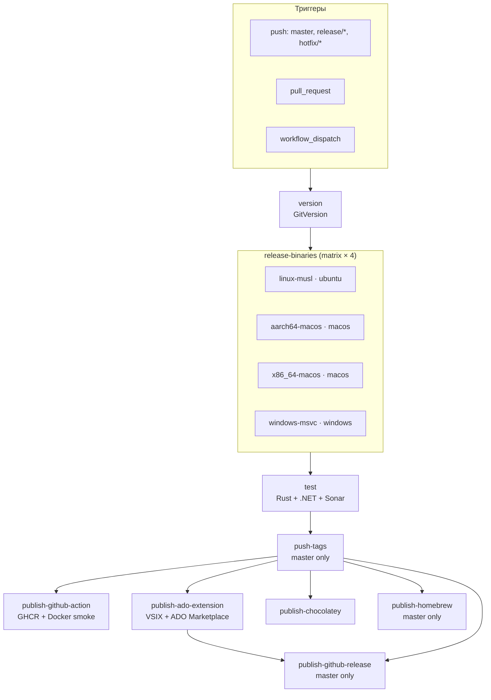

# CI/CD — детальная диаграмма

Оркестратор: [`.github/workflows/ci.yml`](../.github/workflows/ci.yml)

Триггеры: **push** (`master`, `release/*`, `hotfix/*`), **pull_request**, **workflow_dispatch**.

---

## Mermaid



---

## ASCII (полная цепочка)

```
ci.yml
│
├─ version                              [ubuntu-latest]
│     └─ GitVersion → version, major, minor, channel, prerelease
│
├─ release-binaries (matrix × 4)        [needs: version, fail-fast: false]
│     ├─ binary-x86_64-unknown-linux-musl       ubuntu-latest
│     ├─ binary-aarch64-apple-darwin            macos-latest
│     ├─ binary-x86_64-apple-darwin             macos-latest
│     └─ binary-x86_64-pc-windows-msvc          windows-latest
│           │
│           ├─ всегда:              ado-binary-{target}     (linux + windows)
│           └─ на push:              release-binary-{target} (все 4)
│
├─ test                                 [needs: version, release-binaries]
│     ├─ Rust tests + lcov
│     ├─ .NET tests + OpenCover
│     └─ SonarCloud
│
├─ push-tags                            [needs: test]  if: push + master
│     └─ git tags: v{version}, v{X.Y}, v{X}
│
├─ ═════════ параллельно (после test; на master — после push-tags) ═════════
│
├─ publish-github-action                «GHCR + Docker smoke»
│     ├─ download ado-binary-*
│     ├─ docker build
│     ├─ smoke × 3
│     └─ GHCR push (if push):
│           master:         :version, :X.Y, :X, :latest
│           release/hotfix:  :version only
│
├─ publish-ado-extension                «VSIX + ADO Marketplace»
│     ├─ download ado-binary-*
│     ├─ yarn build task
│     ├─ tfx → VSIX → artifact ado-extension-vsix
│     └─ ADO Marketplace (if push + master)
│
├─ publish-chocolatey                   if: push (master/release/hotfix)
│     ├─ download release-binary-*
│     └─ .nupkg → chocolatey.org
│
├─ publish-homebrew                     [needs: push-tags]  if: push + master
│     ├─ package update-nuspec-{version}-src.tar.gz (git archive)
│     └─ brew bump-formula-pr / fork PR
│
└─ publish-github-release               [needs: push-tags, publish-ado-extension]
      ├─ package update-nuspec-{version}-src.tar.gz
      ├─ download ado-extension-vsix
      ├─ download release-binary-*
      ├─ SHA256SUMS (binaries + src)
      └─ GitHub Release v{version}
```

### Composite actions → шаги

| Job (UI name) | Action | Что делает |
|---------------|--------|------------|
| `version` | [`version`](../.github/actions/version/action.yml) | GitVersion |
| `binary-*` | [`release-binary`](../.github/actions/release-binary/action.yml) | `cargo build --release` |
| `test` | [`test`](../.github/actions/test/action.yml) | Rust + .NET + Sonar |
| `push-tags` | [`push-tags`](../.github/actions/push-tags/action.yml) | `push-release-git-tags.sh` |
| `publish-github-action` (**GHCR + Docker smoke**) | [`publish-github-action`](../.github/actions/publish-github-action/action.yml) | Docker smoke + GHCR |
| `publish-ado-extension` (**VSIX + ADO Marketplace**) | [`publish-ado-extension`](../.github/actions/publish-ado-extension/action.yml) | VSIX + Marketplace |
| `publish-chocolatey` | [`publish-chocolatey`](../.github/actions/publish-chocolatey/action.yml) | Chocolatey pack/push |
| `publish-homebrew` | [`publish-homebrew`](../.github/actions/publish-homebrew/action.yml) | Homebrew formula |
| `publish-github-release` | [`publish-github-release`](../.github/actions/publish-github-release/action.yml) | GitHub Release assets |

---

## Артефакты

```
release-binaries (matrix)
  ├─ ado-binary-linux-musl      ──┬─→ publish-github-action (Docker)
  │                               └─→ publish-ado-extension (task binaries)
  ├─ ado-binary-windows-msvc    ────→ publish-ado-extension
  └─ release-binary-*           ──┬─→ publish-chocolatey
                                  └─→ publish-github-release

publish-ado-extension
  └─ ado-extension-vsix         ────→ publish-github-release
```

| Артефакт | Создаёт | Потребляет |
|----------|---------|------------|
| `ado-binary-{target}` | `release-binary` (linux + windows) | `publish-github-action`, `publish-ado-extension` |
| `release-binary-{target}` | `release-binary` (на push) | `publish-chocolatey`, `publish-github-release` |
| `ado-extension-vsix` | `publish-ado-extension` | `publish-github-release` |

---

## Зависимости (`needs`)

| Job | Зависит от | Условие запуска |
|-----|------------|----------------|
| `version` | — | всегда |
| `release-binaries` | `version` | всегда |
| `test` | `version`, `release-binaries` | всегда |
| `push-tags` | `version`, `release-binaries`, `test` | `push` + `master` |
| `publish-github-action` | `version`, `release-binaries`, `test`, `push-tags` | test OK; `push-tags` success/skipped |
| `publish-ado-extension` | то же | то же |
| `publish-chocolatey` | то же | + `push` на `master` / `release/*` / `hotfix/*` |
| `publish-homebrew` | `version`, `push-tags` | `push` + `master` |
| `publish-github-release` | `version`, `push-tags`, `publish-ado-extension` | `push` + `master` |

### Критический путь (`master` push)

```
matrix (4 OS, самый долгий)
  → test
    → push-tags (~секунды)
      → параллельно: publish-github-action | publish-ado-extension | chocolatey | homebrew
        → publish-github-release (ждёт только publish-ado-extension + push-tags)
```

`publish-github-release` **не ждёт** `publish-github-action` и `publish-homebrew`.

---

## По событиям

### `pull_request` / `workflow_dispatch`

```
version → matrix → test
                    ├─ publish-github-action  (только smoke)
                    └─ publish-ado-extension  (только VSIX artifact)
```

`push-tags` и все `publish-*` (кроме пропущенных publish-jobs) — **skipped**.

| Job | GHCR | ADO Marketplace | VSIX artifact | Publish |
|-----|------|-----------------|---------------|---------|
| `publish-github-action` | ❌ (только smoke) | — | — | — |
| `publish-ado-extension` | — | ❌ | ✅ | — |

### `push` → `master`

```
version → matrix → test → push-tags
                              ├─ publish-github-action      (GHCR все теги)
                              ├─ publish-ado-extension        (VSIX + ADO)
                              ├─ publish-chocolatey
                              ├─ publish-homebrew
                              └─ publish-ado-extension
                                    └─ publish-github-release
```

### `push` → `release/*`, `hotfix/*`

```
version → matrix → test
                    ├─ publish-github-action   (GHCR :version)
                    ├─ publish-ado-extension   (VSIX artifact)
                    └─ publish-chocolatey
```

`push-tags`, `publish-homebrew`, `publish-github-release` — **skipped**.

| Job | GHCR | ADO | Chocolatey |
|-----|------|-----|------------|
| `publish-github-action` | `:version` only | — | — |
| `publish-ado-extension` | — | ❌ | — |
| `publish-chocolatey` | — | — | ✅ |

---

## Секреты

| Secret | Job / Action | Назначение |
|--------|--------------|------------|
| `SONAR_TOKEN` | `test` | SonarCloud scan |
| `TAGTOKEN` | `push-tags`, `publish-homebrew` | Git tags; Homebrew fork push / initial PR (`repo` scope) |
| `AZDO_MARKETPLACE_PAT` | `publish-ado-extension` | ADO Marketplace publish (`master`) |
| `CHOCOLATEY_API_KEY` | `publish-chocolatey` | Push `.nupkg` → chocolatey.org |
| `HOMEBREW_GITHUB_API_KEY` | `publish-homebrew` | Classic PAT with **`public_repo`** for `gh pr create`, REST PR API, and `brew bump-formula-pr`; fallback to `TAGTOKEN` on initial PR |
| `GITHUB_TOKEN` | `publish-github-action` | GHCR login + push |

Все секреты передаются в composite actions через `with:` в workflow (не через `secrets:` на уровне шага composite action).

Публикация в Homebrew / Chocolatey / GitHub Release assets: [packaging.md](packaging.md).
